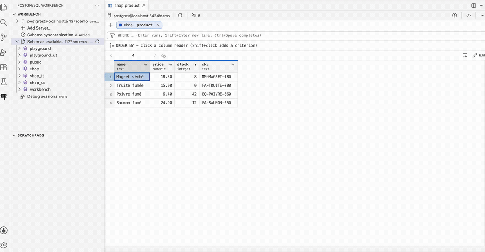
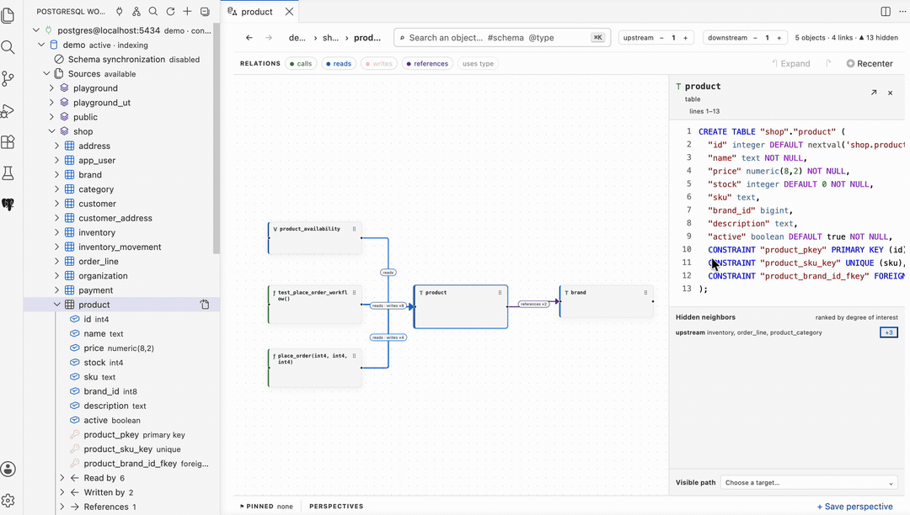
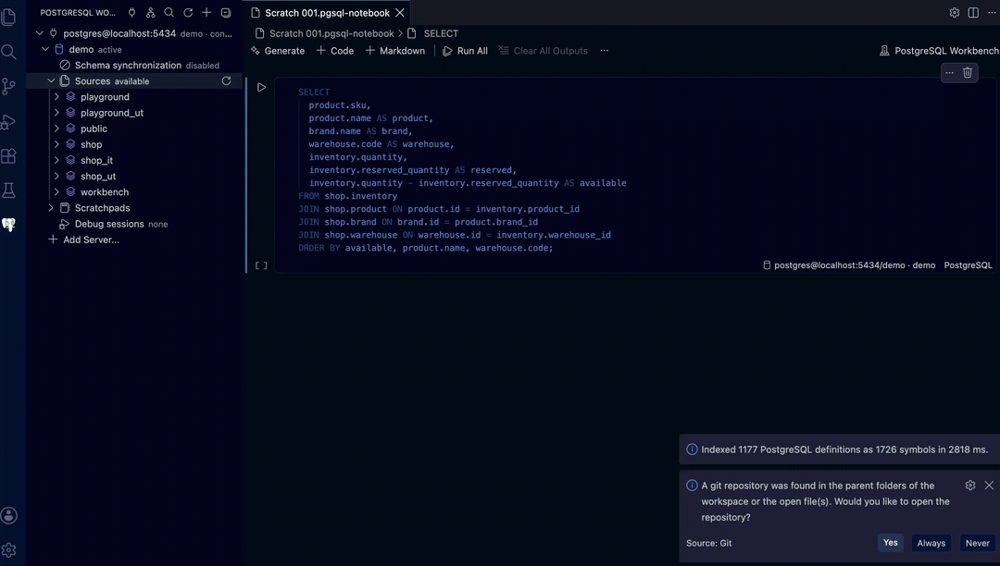
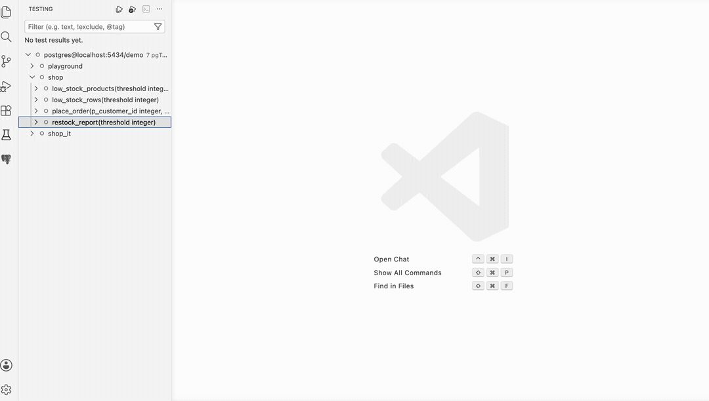
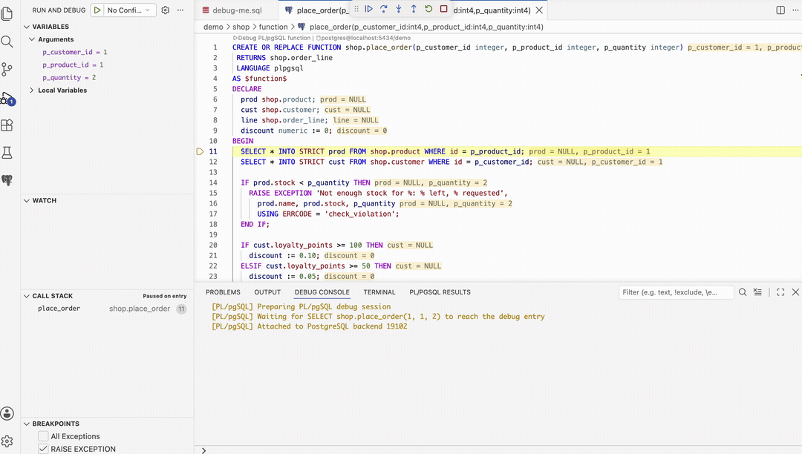

# PostgreSQL Workbench

[](https://marketplace.visualstudio.com/items?itemName=ng-galien.postgresql-workbench)
[](https://ng-galien.github.io/postgresql-workbench/)
[](https://github.com/ng-galien/postgresql-workbench/releases/latest)
[](https://github.com/ng-galien/postgresql-workbench/actions/workflows/ci.yml)
[](https://hub.docker.com/r/galien0xffffff/postgres-debugger)
[](LICENSE)

Turn VS Code into a coherent PostgreSQL development environment: understand a
schema, query real data, test routines, inspect coverage, and debug PL/pgSQL
without switching tools.

Built for your **development database**: local PostgreSQL, Docker, or self-hosted.

Open the [documentation site](https://ng-galien.github.io/postgresql-workbench/)
for focused guides to the Cockpit, SQL scratchpads, pgTAP coverage, the debugger,
the standalone DAP server, and the complete command and settings reference.
The complete Schemas-to-editor drag-and-drop contract is maintained in the
[SQL authoring guide](https://ng-galien.github.io/postgresql-workbench/docs/sql-authoring.html#compose-sql-by-drag-and-drop).

## See the Workbench in action

### Read and correct table data without leaving the editor

Open any table, view, or query result in an editable grid that owns its query:
join a related table on the key the planner derives, filter on what a cell holds,
sort, and correct a value. Every change is held until you apply them together, in
one guarded transaction — and the query stays SQL you can open, read, and edit.



### Understand the architecture before changing it

Focus a central table, expand upstream and downstream relationships, and move
through the live PostgreSQL graph without losing context.



### Query data in persistent SQL scratchpads

Keep notebooks bound to the right database, execute business queries, and work
with a bounded, sortable result grid designed for real PostgreSQL values.



### Run pgTAP tests and inspect native coverage

Discover database tests in VS Code's Test Explorer, run them with coverage, and
jump directly to statement and branch coverage in the routine source.



### Debug PL/pgSQL with familiar VS Code controls

Stop inside a routine, step through production-shaped logic, inspect composite
variables, and keep PostgreSQL notices and query results close at hand.



## Read and write table data

Open any table, view, or query result in a **Data View**: an editable grid that
owns its query. Add a column, join a related table on the key the planner chose,
filter with `WHERE` completions from the indexed catalog, sort, hide what you do
not need, and page through a relation too large to load at once.

Where the rows come from exactly one table whose identity is projected, the grid
writes back: edit cells, add rows, delete rows — with what the deletion drags
along said before it happens — then apply everything in one guarded transaction.
A row that changed since it was loaded stops the write instead of overwriting it.
Export the selection, the loaded rows, or the whole query as CSV, TSV, JSON, SQL
`INSERT`, or Markdown.

Open one from the database tree, from a statement in a SQL file, or from a
Scratchpad result. See the [Data View
guide](https://ng-galien.github.io/postgresql-workbench/docs/data-view.html).

## One database context, one connected workflow

- **PostgreSQL Cockpit** — explore indexed schemas, dependencies, callers, reads,
  writes, references, pins, and saved perspectives.
- **SQL notebooks** — create persistent scratchpads, retain their database
  binding, page through results, sort columns, inspect structured values, and
  export bounded previews.
- **Schema synchronization** — opt in to PostgreSQL DDL notifications and update
  the structural index incrementally when database objects change.
- **pgTAP and coverage** — discover and run database tests, then inspect native
  statement and branch coverage in the editor.
- **PL/pgSQL debugger** — use breakpoints, step controls, inline values, the
  Variables panel, Debug Console, and structured PostgreSQL values.
- **Connection-aware navigation** — open several PostgreSQL Connections at once
  and keep Schemas, Cockpit, notebooks, results, tests, and debugging attached to
  the exact Connection they belong to.

## Start a debug-ready PostgreSQL from VS Code

The debugger requires the [pldebugger](https://github.com/ng-galien/pldebugger)
server extension. Run:

> **PostgreSQL Workbench: Start Local Debug Database (Docker)**

Choose PostgreSQL 13–18 and a local port. The extension pulls the selected
[Docker image](https://hub.docker.com/r/galien0xffffff/postgres-debugger),
starts it on `127.0.0.1`, waits until PostgreSQL is ready, creates `pldbgapi`,
then saves and opens the Connection automatically. PostgreSQL 17 and port 5432
are the defaults. The local database, user, and password are all `postgres`.

> [!WARNING]
> These fixed credentials are only for a disposable development container bound
> to `127.0.0.1`. Never expose this container on `0.0.0.0`, a LAN interface, or
> a remote host. Use a unique strong password for any non-local deployment.

The images support amd64 and arm64. To run one manually instead:

```bash
docker run -d --name pg-debug -p 127.0.0.1:5432:5432 \
  -e POSTGRES_PASSWORD=postgres \
  galien0xffffff/postgres-debugger:17

docker exec pg-debug psql -U postgres -d postgres \
  -c 'CREATE EXTENSION IF NOT EXISTS pldbgapi'
```

Already have a PostgreSQL database? Run **`PostgreSQL Workbench: Check Connection Requirements`** — the
extension diagnoses what's missing and guides you through the setup, including
running `CREATE EXTENSION pldbgapi` for you when possible.

> **Managed PostgreSQL services generally do not expose pldebugger.** Check your
> provider's supported-extension list. If `plugin_debugger` and `pldbgapi` are
> unavailable, debug against a local, Docker, or self-hosted development
> database, then deploy.

## Debugging features

- **Step-by-step debugging** — step over, step into, continue, across nested calls
- **Breakpoints** — validated against executable lines; conditional breakpoints and logpoints supported
- **Rich variables panel** — records, composites, arrays, and JSONB expand into structured trees when the server exposes them
- **Anonymous record inspection** — expands `record` values populated by `SELECT INTO` and `FOR ... SELECT`; explicit SQL casts preserve precise field types
- **Set variable** — change a variable's value mid-session from the Variables panel
- **Inline values** — variable values displayed in the editor while stepping
- **Debug Console** — `RAISE NOTICE/WARNING` output, plus SQL evaluation in the REPL
- **Data View** — editable grid on tables, views, and query results: compose the query and its joins, filter and sort, edit and add rows, apply in one guarded transaction, and export to CSV/TSV/JSON/SQL/Markdown
- **SQL results panel** — bounded result grid with JSON/composite inspection, history, copy, and CSV/JSON preview export
- **CodeLens** — associate a free SQL document with one PostgreSQL connection,
  run every Statement directly, and debug only the `CALL` / `SELECT` routine
  entries that Workbench can resolve safely; routine definitions offer
  **Debug deployed routine**
- **Routine comparison** — compare a local PL/pgSQL definition with the exact overloaded routine in the active indexed PostgreSQL snapshot
- **Function explorer** — browse Connections → schemas → functions in the sidebar, debug from a right-click
- **Zero launch.json needed** — registered Connections appear in "Run and Debug"; launched sessions are saved to `launch.json` for one-key replay with F5
- **Connection manager** — paste a connection string, import from SQLTools/pgsql extensions, passwords stored in VS Code secrets
- **Session recovery** — inspect and terminate stale or blocked DAP sessions from the open Connection in the Functions view
- **Semantic highlighting** — rich PL/pgSQL coloring including dollar quoting
- **pgTAP Test Explorer and coverage** — discover database tests, run selected suites, and inspect native statement/branch coverage in the editor

## Quick Start

1. Open any `.sql` or `.pgsql` file. Each non-empty PostgreSQL Statement gets a **Run SQL** CodeLens.
2. Click **Choose Document Association** once. A single saved connection is associated automatically on the first Run.
3. Click **Run SQL**. PostgreSQL executes that Statement and reports its result or error without requiring it to be debuggable.
4. For a resolved PL/pgSQL `CALL` or function `SELECT`, click the additional **Debug PL/pgSQL** CodeLens; a `CREATE OR REPLACE` definition offers **Debug deployed routine**, which debugs the routine deployed in PostgreSQL, not the edited text.
5. The debugger stops on entry — step with F10/F11, inspect variables, or set breakpoints in the source.
6. Run and Debug results appear in the **PostgreSQL Results** panel.

Notes:
- `Debug call` is intentionally shown only for standalone SQL calls that can be replayed safely.
- One Document Association is shared by every Run and Debug action in the same free SQL file. Changing it never affects any other open Connection.
- Virtual source documents use the exact canonical Code Moniker symbol URI
  (`code+moniker://...`) and expose routine-definition debugging, not call-site replay.

### Automatic Workbench schema synchronization

The Workbench index describes PostgreSQL structure, not table data. Automatic
synchronization is disabled by default and never reacts to `INSERT`, `UPDATE`,
or `DELETE`. Enable it globally or for the current workspace with
`postgresql-workbench.workbench.schemaSync.enabled`, or use **Configure Schema
Synchronization** on one Connection to store an explicit connection
override.

Enabling the option does not alter the database. Select **Provision Schema
Synchronization** separately and confirm the operation. Provisioning creates
two database-level PostgreSQL event triggers plus their notification functions
in the support schema configured by
`postgresql-workbench.workbench.schemaSync.supportSchema` (`workbench` by default).
PostgreSQL requires superuser privileges to create event triggers. The listener
uses a dedicated connection and the fixed `plpgsql_workbench_ddl` channel in
that database; payloads contain structural object identities but no credentials
or table data.

The operation is idempotent and refuses to replace unrelated functions or event
triggers with colliding names. **Remove Schema Synchronization Provisioning**
removes only the two Workbench event triggers and notification functions,
without `CASCADE`; the support schema itself is retained. If notifications may
have been missed, the index is marked desynchronized and a complete catalog
refresh is required before it is presented as fresh again.

## Debug Configuration

Sessions launched from CodeLens or the sidebar are automatically saved to
`.vscode/launch.json`, so you can relaunch them with F5. You can also write
configurations by hand:

```json
{
  "type": "postgresql-workbench",
  "request": "launch",
  "name": "Debug my_function",
  "connection": "localhost:5432/mydb:postgres",
  "sql": "SELECT my_function()",
  "stopOnEntry": true
}
```

`connection` is the Connection ID shown in the sidebar; if omitted, the active
Connection is used. Configurations never contain credentials — passwords stay
in VS Code secret storage. `stopOnEntry` defaults to `true`; set it to `false`
only for an intentional run-to-breakpoint launch. An optional `attachTimeoutMs`
(default 30000) bounds how long a still-running target may wait to reach the
debugged routine.

### Result safety limits

Target rows are streamed through the adapter instead of being accumulated by
the PostgreSQL client. The call always runs to completion, while the UI retains
only a bounded preview:

- 200 rows by default, configurable with
  `postgresql-workbench.results.maxRows` (20–1000)
- 64 KiB maximum per displayed cell
- 1 MiB maximum per structured result event
- 10 recent results and 5 MiB maximum retained by the extension

These are retention limits, not PostgreSQL wire-protocol limits: PostgreSQL and
node-postgres still receive each individual field before the adapter can
truncate its preview. To prevent avoidable copies, `bytea`, JSON, and JSONB stay
textual on the target connection, and binary buffers are sliced before hex
conversion. Do not use the debugger to fetch intentionally enormous individual
values.

The panel records running, completed, and failed calls in the same bounded
history. Result labels include the originating callsite when available. The
grid uses one keyboard tab stop: navigate cells with the arrow keys, inspect
with Enter or Space, and copy with Ctrl/Cmd+C. JSON values can be inspected in
formatted or raw form.

Truncation warnings distinguish row, cell, and payload limits. Copying or
exporting an incomplete preview requires confirmation. The Debug Console
receives only a portable scalar value or compact summary, never an unbounded
table. `postgresql-workbench.results.autoReveal` opens the panel without taking
keyboard focus when a call completes or fails. A running call updates history
silently so it cannot compete with debugger source navigation.

CSV and clipboard TSV exports neutralize spreadsheet formulas and represent
PostgreSQL `NULL` as `\N`, keeping it distinct from an empty string. JSON export
preserves native `null` values and includes truncation metadata.

## pgTAP tests and PL/pgSQL coverage

Install [pgTAP](https://pgtap.org/) in the development database and organize
test functions using configurable `schema.function` glob patterns. The defaults
are `*_ut.test_*` and `*_it.test_*`. Matching functions must return
`SETOF text`; zero-argument functions can be run automatically. Open VS Code's
**Testing** view, expand the PostgreSQL connection, then use **Run Tests** or
**Run Tests with Coverage**.

Keep test entry points and their fixtures or helpers in dedicated test schemas.
When a pattern matches a test, its schema is treated as test infrastructure:
the dependency walker can traverse helper functions in that schema, but they
are not reported as application coverage.

Override discovery globally or in workspace settings when a project uses a
different convention:

```json
{
  "postgresql-workbench.tests.patterns": [
    "tests.*",
    "quality.check_*"
  ]
}
```

Coverage is collected independently from the debugger. The extension:

- resolves direct and transitively called PL/pgSQL routines by PostgreSQL OID,
  including overloads;
- instruments the selected routine set once and runs each selected pgTAP test
  once in a dedicated transaction;
- publishes statement and branch counts through VS Code's native Test Coverage
  view and editor gutter;
- always rolls back the transaction after success, failure, timeout, or
  cancellation;
- rejects routines containing transaction control because they cannot be
  isolated safely by this runner;
- detects deployed source changes before returning detailed coverage;
- bounds routine count, TAP output, duration, and cross-database parallelism.

The database role needs permission to execute the selected tests and
`CREATE OR REPLACE` the covered routines. Coverage briefly takes PostgreSQL
locks on those routines. Run it against a development or isolated test
database, not a production database.

Available settings:

- `postgresql-workbench.tests.patterns` — pgTAP discovery globs matched against
  `schema.function`; configurable globally or per workspace;
- `postgresql-workbench.coverage.include` and `.exclude` — glob patterns matched
  against `schema.name(identity arguments)`;
- `postgresql-workbench.coverage.maxRoutines` — maximum routines per request
  (default 200);
- `postgresql-workbench.coverage.maxOutputLines` — TAP lines retained per test
  (default 200);
- `postgresql-workbench.coverage.maxOutputBytes` — maximum TAP payload retained per
  test (default 1 MiB);
- `postgresql-workbench.coverage.maxParallelDatabases` — independent databases run
  concurrently (default 2);
- `postgresql-workbench.coverage.timeoutMs` — per-database suite timeout
  (default 300000 ms).

Run **PostgreSQL Workbench: Export Last Coverage** to write the most recent native coverage
result as LCOV or versioned JSON. The export contains the exact canonical
`code+moniker://` symbol URIs used by the editor, debugger, Test Explorer, and
coverage view, so overloaded routines remain unambiguous.

Current limitation: dependency discovery uses schema-qualified calls in the
pgTAP function AST. Dynamic SQL and unqualified calls cannot be mapped
reliably; explicitly selecting such an unmapped test reports an error, while a
larger suite selection skips it.

## Requirements

- PostgreSQL 13+ with the [pldebugger](https://github.com/ng-galien/pldebugger) extension
- `shared_preload_libraries = 'plugin_debugger'` in `postgresql.conf` (needs a restart)
- `CREATE EXTENSION pldbgapi;` in your database — the extension offers to run this for you

Coverage additionally requires `CREATE EXTENSION pgtap;`; it does not require
`pldebugger`, `plugin_debugger`, or `pldbgapi`.

### pldebugger compatibility

The debugger works with the standard EnterpriseDB pldebugger packages
(`postgresql-17-pldebugger` on Debian/Ubuntu), distribution packages, and the
[ng-galien fork](https://github.com/ng-galien/pldebugger).

- **Standard/legacy builds:** stepping, breakpoints, stack frames, and scalar
  variables work. Some builds do not publish PL/pgSQL records, rows, or record
  fields; those values are omitted cleanly without breaking the session.
- **Enhanced fork / Docker image:** additionally publishes composite and
  anonymous record values as JSON, enabling structured expansion in VS Code.

The extension never requires the fork for basic debugging.

## How It Works

This extension implements the [Debug Adapter Protocol](https://microsoft.github.io/debug-adapter-protocol/)
(DAP) over PostgreSQL's `pldbgapi` debugging interface. Two database connections
are used: one controls the debugger, the other executes your SQL. Every session
uses a unique `application_name` and cleans up its own backends — concurrent
debug sessions (multiple windows or teammates on a shared dev server) don't
interfere with each other.

If a client crash still leaves a session behind, expand the open Connection
in **Functions & Procedures**, open **Debug sessions**, select the stale
session, and confirm **Terminate**. Recovery groups the listener and target as
one logical session and revalidates their reserved DAP application names before
terminating them; unrelated PostgreSQL connections are never selected.

## Telemetry

This extension does not collect any telemetry data.

## Support and security

- Problems and feature requests: [GitHub Issues](https://github.com/ng-galien/postgresql-workbench/issues)
- Setup diagnostics: run **`PostgreSQL Workbench: Check Connection Requirements`**
- Security reports: see [SECURITY.md](SECURITY.md)
- Support policy and useful diagnostic information: see [SUPPORT.md](SUPPORT.md)

## License

[MIT](LICENSE). Third-party components bundled in the extension are listed in
[THIRD_PARTY_NOTICES.md](THIRD_PARTY_NOTICES.md).
